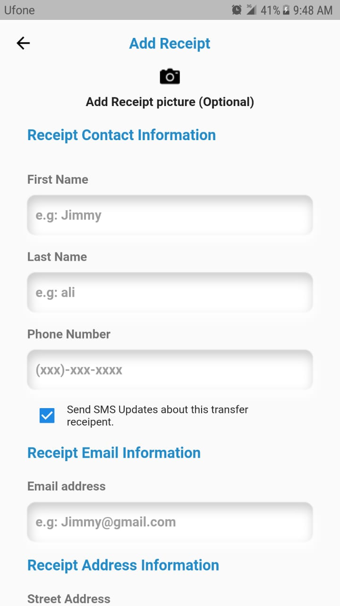
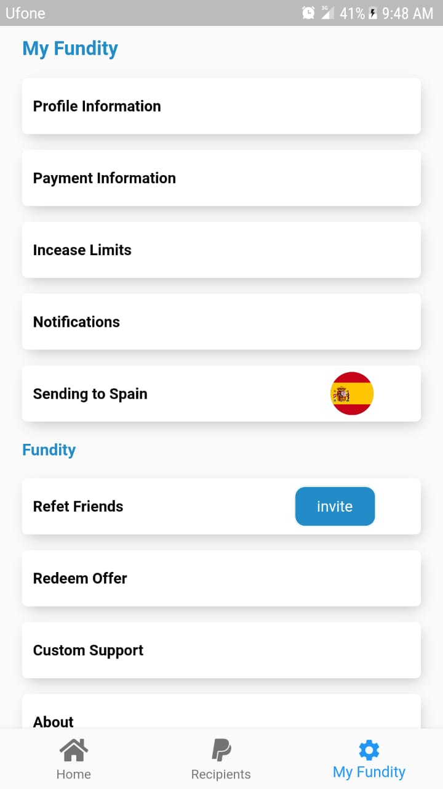
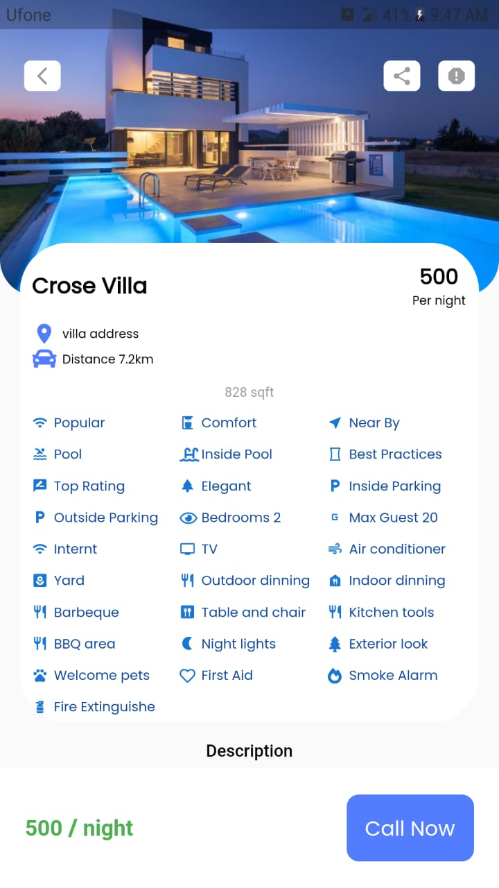

# Multi_Vendor_APP

-------------------------------------------------
Multi Vendor APP– FEATURES
-------------------------------------------------

• A beautiful modern gallery with no ads or popups

• Photo editor – crop, rotate, resize, draw, filters & more

• No internet access needed, giving you more privacy, security and stability

• No unnecessary permissions required

• Quickly search images, videos & other files

• Open and view many different photo and video types (RAW, SVG, panoramic, GIF etc)

• A variety of intuitive gestures to easily edit, rotate & organize files

• Lots of ways to filter, group and sort files

• Customize the appearance of Simple Gallery Pro

• Available in over 30 languages

• Mark files as favorites for quick access

• Protect your photos & videos with a pattern, pin or fingerprint

• Use pin, pattern & fingerprint to protect the app launch or specific functions too

• Recover deleted photos & videos from the recycle bin

• Toggle visibility of files to hide photos & videos

• Create a customizable slideshow of your files with many options

• View detailed information of your files (resolution, EXIF values etc)

• Zoom high quality photos, videos and GIFs easily with gestures

• Easily force portrait or landscape orientation for easy video viewing

• Quick file share to social media, email or anywhere else

• Print images or set them as wallpaper with a few clicks

• Create home screen shortcuts or widgets to easily access any file or folder

• Show the image location on a map, if available

• Obvious presence of standard operations like rename, copy/move, un/hide, delete

• Rewind videos with horizontal gestures

• Change photo and video brightness, or volume with vertical gestures

• Reorder, lock folders or change cover thumbnails anytime

• Set any image as wallpaper without hassle

